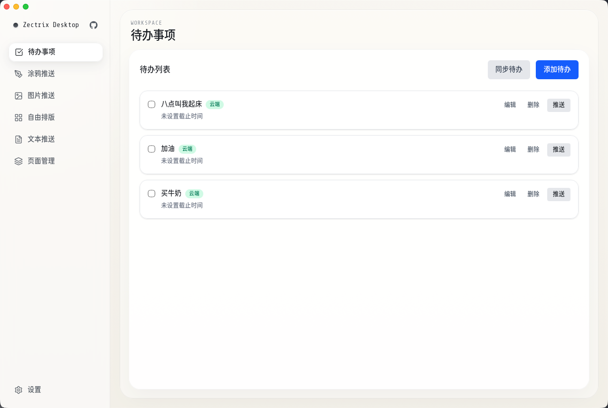
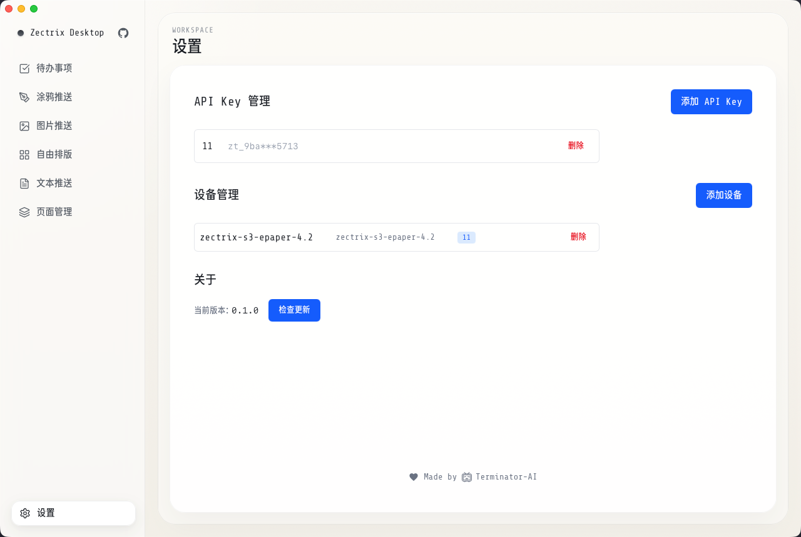
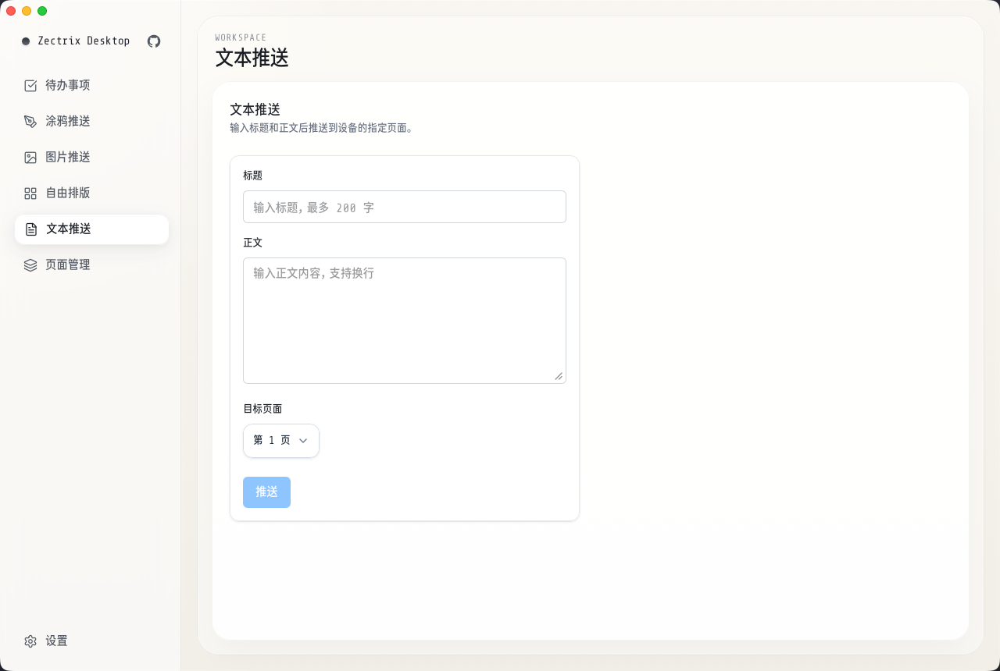
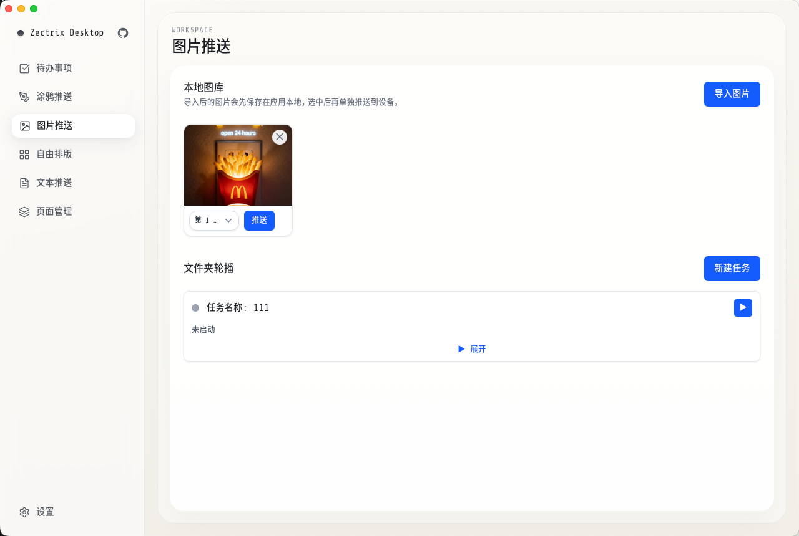
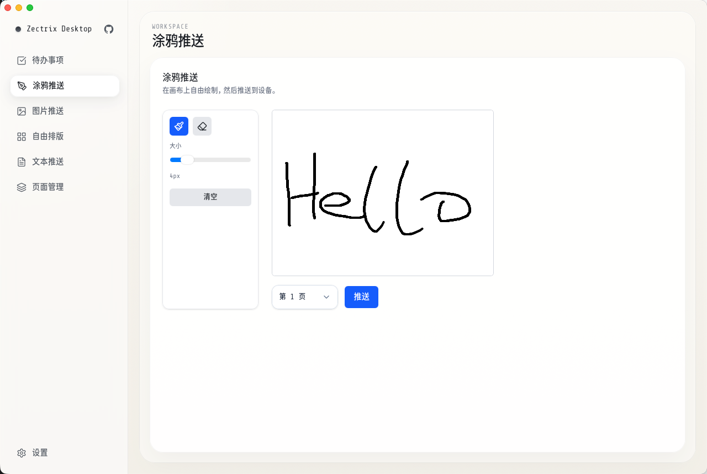

# Zectrix Desktop

极趣 Note 4 桌面客户端 — 待办管理、内容推送
工具，配合 Zectrix 墨水屏设备使用。



## 1. 项目介绍

Zectrix Desktop 是极趣 Note 4 服务的桌面客户端应用，为用户提供便捷的本地待办管理和内容推送功能。

### 核心特性

- **本地优先架构** — 待办数据优先存储在本地，支持离线操作，手动同步到云端
- **多类型内容推送** — 支持文本、图片、涂鸦等多种内容推送到墨水屏设备
- **股票行情推送** — A 股实时行情监控，支持定时循环推送
- **插件市场** — 内置精选插件与自定义 JavaScript 插件，支持循环任务自动化
- **设备管理** — 通过 MAC 地址绑定设备，本地缓存设备信息
- **安全存储** — API Key 使用操作系统级 Keyring 加密存储
- **跨平台支持** — 支持 Windows、 macOS、Linux

### 技术栈

| 层级     | 技术                                                    |
| -------- | ------------------------------------------------------- |
| 前端     | React 19 + TypeScript + React Router 7 + TanStack Query |
| UI       | Tailwind CSS 4 + Radix UI + Lucide Icons                |
| 桌面框架 | Tauri 2                                                 |
| 后端     | Rust (reqwest, image, keyring)                          |
| 测试     | Vitest (前端) + cargo test (Rust)                       |

---

## 2. 使用指南

### 2.1 初次配置

首次使用需要进行以下配置：



1. **获取 API Key**
   - 访问 [https://cloud.zectrix.com/home/api-keys](https://cloud.zectrix.com/home/api-keys) 创建 API Key
   - 在应用「设置」页面添加 API Key

2. **绑定设备**
   - 在「设置」页面点击「添加设备」
   - 输入设备的 MAC 地址（格式：`XX:XX:XX:XX:XX:XX`）
   - 系统会自动验证设备并获取设备别名

### 2.2 待办事项

待办事项是应用的核心功能，支持完整的 CRUD 操作和云端同步。


### 2.3 文本推送

「文本推送」功能支持将文本内容直接推送到设备指定页面。



### 2.4 图片推送

「图片推送」功能支持图片导入、编辑和推送。


### 2.5 文件夹轮播

「文件夹轮播」功能支持将指定文件夹中的多张图片按设定间隔自动循环推送到设备。

### 2.6 涂鸦推送

「涂鸦推送」功能支持在画布上自由绘制并推送。


### 2.7 自由排版

「自由排版」功能提供更灵活的文本排版选项。

### 2.8 股票推送

「股票推送」功能支持将 A 股实时行情推送到墨水屏设备。

- **监控列表** — 添加 6 位股票代码，自动获取股票名称和实时行情
- **单次推送** — 手动推送当前监控列表的行情快照
- **循环推送** — 设置目标页面和推送间隔（30秒/1分钟/5分钟/10分钟），自动定时推送

### 2.9 插件市场

「插件市场」是应用的核心扩展功能，支持通过插件生成动态内容并推送到设备。

#### 内置插件

应用内置多款精选插件，无需编写代码即可使用：

| 插件名称       | 功能描述                               | 配置选项           |
| -------------- | -------------------------------------- | ------------------ |
| 随机显示猫猫   | 获取随机猫咪图片                       | 无                 |
| 随机显示狗狗   | 获取随机狗狗图片                       | 无                 |
| 随机显示鸭子   | 获取随机鸭子图片                       | 无                 |
| 随机显示 Waifu | 获取随机动漫图片                       | 分类（SFW/NSFW）   |
| 文本转二维码   | 将输入文本转换为二维码图片             | 文本内容           |
| 随机古诗词     | 获取随机古诗词并格式化显示             | 无                 |

内置插件支持配置选项，可在推送前调整参数。

#### 自定义插件

用户可编写 JavaScript 代码创建自定义插件，实现任意数据源的内容推送。

**返回格式**

插件代码执行后需返回以下格式：

```javascript
// 返回文本
return { type: "text", text: "推送内容", fontSize: 24 };

// 返回图片（Base64）
return { type: "image", imageDataUrl: "data:image/png;base64,...", title: "标题" };

// 返回图片（URL）
return { type: "image", imageUrl: "https://example.com/card.png", title: "标题" };
```

**示例代码**

```javascript
// 文本示例
const now = new Date().toLocaleString();
return {
  type: "text",
  text: `当前时间：${now}`,
};

// 接口请求示例
const response = await fetch("https://api.example.com/data");
const data = await response.json();
return {
  type: "text",
  text: `状态：${data.message}`,
};

// 图片 URL 示例
return {
  type: "image",
  imageUrl: "https://example.com/daily-card.png",
};
```

**运行环境**

- 插件代码在异步函数中执行，支持 `async/await`
- 内置 `fetchJson()`、`fetchBase64()`、`generateQrCode()` 等辅助函数
- 配置选项通过 `config` 对象访问（如 `config.text`）

#### 循环任务

插件支持创建循环任务，按固定间隔自动执行并推送：

- **间隔选项** — 1分钟、5分钟、10分钟、30分钟、60分钟
- **任务管理** — 在「任务管理」标签页启动、停止、删除任务
- **状态监控** — 查看任务运行状态、上次推送时间、错误信息

---

## 3. 开发指南

### 3.1 开发环境

**前提条件**

| 工具      | 版本要求                |
| --------- | ----------------------- |
| Node.js   | 20+                     |
| pnpm      | 推荐                    |
| Rust      | stable                  |
| Tauri CLI | cargo install tauri-cli |

**安装依赖**

```bash
pnpm install
```

### 3.2 本地开发

启动开发服务器：

```bash
pnpm tauri dev
```

这会同时启动：

- Vite 开发服务器（前端热更新）
- Tauri 窗口应用

### 3.3 项目结构

```
zectrix-desktop/
├── src/                          # 前端源码
│   ├── app/                      # 应用入口和路由
│   ├── components/               # UI 组件
│   │   ├── layout/               # 布局组件
│   │   └ ui/                     # Radix UI 封装组件
│   ├── features/                 # 功能模块
│   │   ├── devices/              # 设备管理
│   │   ├── free-layout/          # 自由排版
│   │   ├── images/               # 图片推送
│   │   ├── plugins/              # 插件市场
│   │   ├── settings/             # 设置页面
│   │   ├── sketch/               # 涂鸦推送
│   │   ├── stocks/               # 股票推送
│   │   ├── templates/            # 文本推送
│   │   └── todos/                # 待办事项
│   └── lib/                      # 工具库
│       └── tauri.ts              # Tauri 命令封装
├── src-tauri/                    # Rust 后端
│   ├── src/
│   │   ├── api/                  # API 客户端
│   │   ├── commands/             # Tauri 命令
│   │   ├── models.rs             # 数据模型
│   │   ├── state.rs              # 应用状态管理
│   │   ├── storage/              # 本地存储
│   │   └── lib.rs                # 入口
│   └── Cargo.toml
├── package.json
├── vite.config.ts
└── tailwind.config.ts
```

### 3.4 测试

**前端测试**

```bash
pnpm vitest run        # 运行所有测试
pnpm vitest watch      # 监听模式
```

**Rust 测试**

```bash
cargo test --manifest-path src-tauri/Cargo.toml
```

### 3.5 构建

构建生产版本：

```bash
pnpm tauri build
```

构建产物位于 `src-tauri/target/release/bundle/` 目录。

### 3.6 数据存储

应用数据存储在用户目录下的 `.zectrix-note` 文件夹：

```
~/.zectrix-note/
├── config.json          # 应用配置（同步时间等）
├── api_keys.json        # API Key 记录
├── devices.json         # 设备缓存
├── todos.json           # 待办数据
├── text_templates.json  # 文本模板
├── image_templates.json # 图片模板索引
└── images/              # 图片文件存储
    ├── 1.png
    ├── 2.png
    └── ...
```

### 3.7 API 参考

应用通过 `https://cloud.zectrix.com/open/v1` API 与云端交互：

| 端点                                    | 方法       | 功能           |
| --------------------------------------- | ---------- | -------------- |
| `/devices`                              | GET        | 获取设备列表   |
| `/todos`                                | GET/POST   | 待办 CRUD      |
| `/todos/{id}`                           | PUT/DELETE | 更新/删除待办  |
| `/todos/{id}/complete`                  | PUT        | 标记完成       |
| `/devices/{id}/display/text`            | POST       | 推送文本       |
| `/devices/{id}/display/structured-text` | POST       | 推送结构化文本 |
| `/devices/{id}/display/image`           | POST       | 推送图片       |

所有请求需要 `X-API-Key` Header 认证。

---

## 作者

Made with ❤️ by [Terminator-AI](https://space.bilibili.com/328381287)

---

## 许可证

GNU General Public License v3.0 (GPL-3.0)
